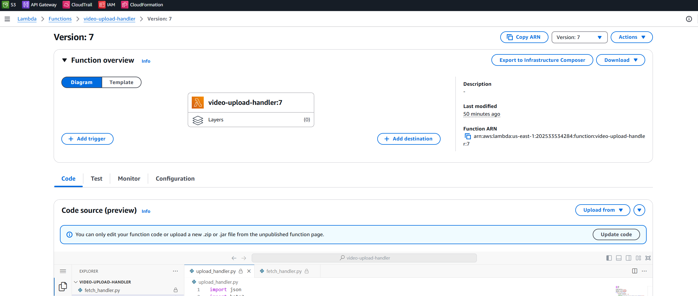

# 👉 AWS Serverless Project: Video Upload and Playback Application

## 👉 Follow Complete Documentation: 📄 [AWS Serverless Video Upload and Playback Application](https://your-repository-link)


---

## Architecture Diagram:


---

## Table of Contents

- [Project Use Case](#project-use-case)
- [Architecture Overview](#architecture-overview)
- [Key Requirements](#key-requirements)
- [Tech Stack](#tech-stack)
- [Step-by-Step Implementation](#step-by-step-implementation)
  - [1. Setting Up Amazon S3 for Video Storage](#1-setting-up-amazon-s3-for-video-storage)
  - [2. Setting Up DynamoDB for Metadata Storage](#2-setting-up-dynamodb-for-metadata-storage)
  - [3. Creating Lambda Functions](#3-creating-lambda-functions)
  - [4. Configuring API Gateway](#4-configuring-api-gateway)
  - [5. Hosting Frontend on S3](#5-hosting-frontend-on-s3)
  - [6. Testing the Application](#6-testing-the-application)
- [Monitoring and Optimization](#monitoring-and-optimization)
- [Challenges and Solutions](#challenges-and-solutions)
- [Conclusion](#conclusion)

---

## Project Use Case

This application allows users to upload video files directly to an S3 bucket via a serverless architecture. The videos are stored in S3, and metadata such as video URLs is managed using DynamoDB. Users can fetch and playback videos seamlessly via a modern web interface.

---

## Architecture Overview

### Components:

1. **Frontend**:
   - Built with HTML, CSS, and JavaScript.
   - Hosted on an Amazon S3 bucket with static website hosting enabled.
   - Communicates with the backend using API Gateway.

   - Video application frotnend
   

   - Video uploade successfully
   

   - Video file successfully stored in aws s3 video bucket
   


2. **Backend**:
   - **API Gateway**: Handles API routing.
   - **AWS Lambda**: Serverless functions for video upload and metadata retrieval.

3. **Storage**:
   - **S3**: Stores uploaded video files.
   - **DynamoDB**: Stores metadata like video IDs and URLs.

---

## Key Requirements

1. Scalable and secure architecture.
2. Upload videos directly from the frontend to S3.
3. Fetch video metadata to display and play videos in the browser.

---

## Tech Stack

- **Frontend**: HTML, CSS, JavaScript
- **Backend**: AWS Lambda, API Gateway
- **Database**: DynamoDB
- **Storage**: S3
- **Monitoring**: CloudWatch

---

## Step-by-Step Implementation

### 1. Setting Up Amazon S3 for Video Storage

1. **Create an S3 Bucket**:
   
   aws s3 mb s3://video-upload-bucket

- S3 static web app bucket created
   

2. **Configure CORS**:
   ```json
   [
       {
           "AllowedHeaders": ["*"],
           "AllowedMethods": ["GET", "PUT", "POST"],
           "AllowedOrigins": ["*"]
       }
   ]
   ```

3. **Enable Static Website Hosting**:
   - Navigate to the **Properties** tab in the S3 console.
   - Set **Index Document**: `index.html`.

- S3 Static webapp endpoint created
      

4. **Sync Frontend Files**:
  
   aws s3 sync static-web/ s3://video-upload-bucket
   


---

### 2. Setting Up DynamoDB for Metadata Storage

1. **Create a DynamoDB Table**:
   ```bash
   aws dynamodb create-table \
       --table-name video-metadata \
       --attribute-definitions AttributeName=videoId,AttributeType=S \
       --key-schema AttributeName=videoId,KeyType=HASH \
       --billing-mode PAY_PER_REQUEST
   ```
- DynamoDB table created
      

- DynamoDB metadata url created
   

---

### 3. Creating Lambda Functions

#### Upload Handler

```python
import boto3
import json
import os
import uuid

s3 = boto3.client('s3')
dynamodb = boto3.resource('dynamodb')

BUCKET_NAME = os.environ['BUCKET_NAME']
TABLE_NAME = os.environ['TABLE_NAME']

def lambda_handler(event, context):
    try:
        file_content = event['body']
        file_name = f"{uuid.uuid4()}.mp4"

        # Upload video to S3
        s3.put_object(Bucket=BUCKET_NAME, Key=file_name, Body=file_content)

        # Save metadata to DynamoDB
        table = dynamodb.Table(TABLE_NAME)
        table.put_item(
            Item={
                'videoId': file_name,
                'url': f"https://{BUCKET_NAME}.s3.amazonaws.com/{file_name}"
            }
        )

        return {
            "statusCode": 200,
            "headers": {"Access-Control-Allow-Origin": "*"},
            "body": json.dumps({"message": "File uploaded successfully"})
        }
    except Exception as e:
        return {
            "statusCode": 500,
            "headers": {"Access-Control-Allow-Origin": "*"},
            "body": json.dumps({"error": str(e)})
        }
```

- Lambda video upload function
   

#### Fetch Handler

```python
import boto3
import json
import os

dynamodb = boto3.resource('dynamodb')
TABLE_NAME = os.environ['TABLE_NAME']

def lambda_handler(event, context):
    try:
        table = dynamodb.Table(TABLE_NAME)
        response = table.scan()

        return {
            "statusCode": 200,
            "headers": {"Access-Control-Allow-Origin": "*"},
            "body": json.dumps(response['Items'])
        }
    except Exception as e:
        return {
            "statusCode": 500,
            "headers": {"Access-Control-Allow-Origin": "*"},
            "body": json.dumps({"error": str(e)})
        }
```
- Lambda video fetcher function
   


### 4. Configuring API Gateway

1. **Create an API**:
   - Navigate to **API Gateway** > **Create API**.
   - Choose **HTTP API** and name it `video-app-api`.

2. **Add Routes**:
   - POST `/upload` → `video-upload-handler`.
   - GET `/fetch` → `video-fetch-handler`.

3. **Enable CORS**:
   - Add headers:
     - `Access-Control-Allow-Origin: *`
     - `Access-Control-Allow-Methods: GET, POST, OPTIONS`

- API Routes created
   
- API stage created
      


### 5. Hosting Frontend on S3

1. Sync the frontend files:
   ```bash
   aws s3 sync static-web/ s3://video-upload-bucket
   ```

---

### 6. Testing the Application

1. Open the static website URL in your browser.

   

2. Test video upload functionality.

   

3. Fetch and play videos directly in the browser.

   


## Monitoring and Optimization

1. **Enable CloudWatch Logs** for Lambda functions.
2. Use **CloudFront** for global video distribution.

---

## Challenges and Solutions

1. **CORS Issues**:
   - Ensure correct headers are set in API Gateway and Lambda responses.

2. **Large File Uploads**:
   - Use multipart uploads for larger files.

---

## Conclusion

This serverless application demonstrates how to build a scalable and efficient video upload and playback system using AWS services. It's a robust architecture for handling real-time video processing workflows.

